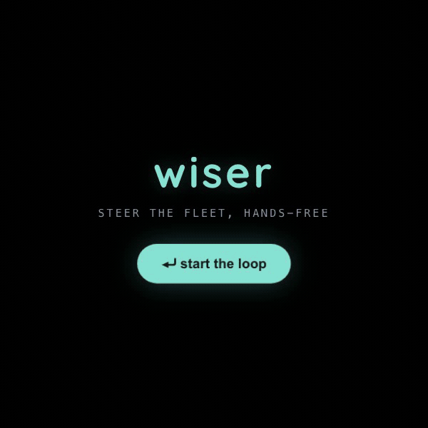

<div align="center">



# wiser

**A fleet of coding agents you run from your glasses — always there, never in the way.**

*Voice-driven Claude agents, surfaced as glanceable cards on Meta Ray-Ban Display glasses.*

<sub>↑ the actual 600×600 lens · <a href="media/wiser-demo.mp4">watch the MP4</a></sub>

</div>

---

## The idea

Coding agents are about to be everywhere — always on, like a colleague who's around all day, building
while you get on with your life. Wonderful, and a little terrifying: an agent that's always there is one
that can always interrupt you.

So here's the question wiser is built around:

> **Can you keep a fleet of coding agents in front of you all day — and barely notice them until they need you?**

Always-available agents are easy. Always-available agents that *don't steal your attention* are the hard,
interesting problem. That tension drives every decision below.

---

## What we built

A hands-free way to run a fleet of coding agents from a live conversation — surfaced on Meta Ray-Ban
Display glasses, steered by voice and Neural Band gestures.

- 🎙 **Agents listen to the room.** A scan loop turns what you say in a meeting into actionable cards —
  no editor, no typing.
- 👓 **It lives on your glasses.** Cards render on the 600×600 lens; you steer with six gestures + voice.
- 🤫 **Glanceable, not streaming.** A whole agent's worth of diffs and logs collapses to one calm line.
  You glance — you don't read.
- ✋ **It interrupts you once.** Only the call you alone can make reaches the lens. Approve or steer with a flick.
- ⚡ **A fleet, not a bot.** Many cheap agents run in parallel, verifier-gated — the best *correct* result wins.
- 📸 **Real-world context, in one gesture.** Snap a photo of a whiteboard sketch and it feeds the same loop.

---

## The hard part: saying less

An agent at work throws off a flood — diffs, logs, reasoning, tool calls. The lens shows almost none of
it: **600×600, one view, no scrolling, a few words.** The whole game is throwing away the noise and keeping
only what you must see or decide. Three channels, each tiny:

- **A card** — one line. A decision, an approval, a blocker. Nothing else.
- **Voice** — the glasses talk, you talk back. That's where the detail lives.
- **Gesture** — six moves on the Neural Band (four swipes, two pinches): approve, reject, drill in, next, ask.

A small, fast model (NVIDIA **Nemotron**, via Nebius) does the squeezing — so compression is our cost story
and our calm story at once.

**Glasses-first rule:** if it's not on the lens, it's not done. The phone holds the logic, secrets, and
state; the interaction and the output happen on the glasses.

---

## The demo — a live brainstorm

The fleet works on a real target: **[`linny`](https://github.com/Evgastap/linny)**, a tiny Linear-style
issue tracker. We brainstorm features out loud; wiser turns the conversation into shipped code.

1. **"wiser on."** It starts listening to the meeting — no dashboard, no feed.
2. **An idea becomes a card.** Someone says *"we need fast issue search."* A cheap model pulls the real idea
   out of the noise and drops it as one card. Then a bug: *"search skips archived issues."* Two cards.
3. **Contribute from the glasses.** A remote teammate sketches a layout on paper, looks at it, and snaps it —
   the photo feeds the same scan and becomes a third card. No laptop.
4. **Approve → the fleet builds.** Each card becomes a coding agent running against the real repo. On the
   lens: one calm line, *building*. No babysitting.
5. **The loop closes.** An agent finishes and the app changes in front of us — the idea someone said out
   loud, now live.

Agents in the room with you. They catch the idea, they build it, and they tap you only when they need you.

---

## The agent workflow

```
 voice / photo ─▶ scan loop ─▶ idea cards ─▶ you approve ─▶ fleet of Claude agents ─▶ verifier
       ▲              (Nemotron/Haiku)            │            (parallel, best-of-N)        │
       │                                          │                                         ▼
       └────────  you steer / approve / clarify (gesture + voice)  ◀────  distiller ─▶ cards ─▶ lens
```

It's a real loop, not a one-shot prompt:

- **Listen → distill.** A cheap model scans the live transcript (and photos) and proposes cards — the
  compression layer that makes the firehose fit on a lens.
- **Fan out.** Approved cards dispatch a fleet of Claude agents in parallel, each on the real repo.
- **Verify, don't trust.** A verifier re-runs the tests; anything fast-but-wrong is thrown out and retried.
- **Best-of-N.** Run many cheap agents and keep the best *correct* one — the bet that many cheap agents beat
  one expensive one.
- **One human steer.** The single mid-loop correction only you can make arrives as one card, and the agents
  finish.

---

## Key architectural decisions

| Decision | Why |
|---|---|
| **Hosted Claude Managed Agents** over self-hosted sandboxes | Anthropic runs the loop *and* a per-session container — we delete our own sandbox infra and ship the fleet faster. |
| **Nemotron (Nebius) for the squeeze**, Claude for the code | Compressing a raw agent result into a card is a cheap-model job. Spend top-tier tokens on writing code, not summarizing it. |
| **Glasses-first, phone-as-brain** | Interaction and output live on the lens; logic, secrets, and state live on the phone. The phone is plumbing; the glasses are the product. |
| **The card contract is the seam** | `{kind, headline, one-liner, actions[]}` decouples fleet ↔ distiller ↔ lens, so three people build three pieces in parallel without stepping on each other. |
| **Verifier-gated best-of-N** | Parallelism is cheap; correctness is not. The verifier — not the model's confidence — decides which result ships. |

---

## Evidence

Cost–quality is the thesis, so we measure it: an offline harness runs each task three ways
(baseline · best-of-N · +1 human steer) against a pytest verifier, plus an agent-driven perf loop on a real
OSS target. **Methodology and live results: [`EVIDENCE.md`](./EVIDENCE.md)** _(run in progress)._

---

## Collaboration

> _Team roster, ownership, and how we split the three pieces — coming here before submission._

<!-- Fill in: who owned glasses/iOS, orchestrator, agent fleet, sandbox; what each person brought. -->

---

## Architecture

Three loosely-coupled pieces, each buildable and demoable on its own:

| Path | What |
|------|------|
| `ios/CameraAccess/` | **Native iOS DAT app — the real glasses client.** Camera + mic + on-lens display + voice + photo-to-brainstorm (Meta Wearables DAT). |
| `backend/` | Node + TypeScript orchestrator (Claude Agent SDK + Managed Agents): STT → scan → fleet → distill → TTS; serves cards/HUD over WebSocket/SSE. Includes the eval harness. |
| `firebase/` | Serverless backend the iOS app calls (Anthropic Managed Agents + Groq STT/TTS). |
| `glasses-webapp/` | Vanilla-JS 600×600 lens app — the card-UI + interaction prototype, runnable in Chrome and on-device. |

**The seam** is the card contract: agents emit results → the distiller normalizes them into
`{kind, headline, one-liner, actions[]}` → the display renders the card + deep-dive.

---

## Run it

> Full setup, the STT/TTS pipeline, and on-glasses deployment live in [`ONBOARDING.md`](./ONBOARDING.md).

```bash
# Backend orchestrator
cd backend && npm install
cp .env.example .env          # fill in GROQ_API_KEY + ANTHROPIC_API_KEY (+ NEBIUS_API_KEY for Nemotron)
npm run dev                   # http://localhost:8787

# Glasses card-UI prototype (laptop demo path)
cd glasses-webapp
npm run demo                  # seeded run, no backend → http://localhost:3000
npm run live                  # live backend
```

In Chrome at ~600×600: arrows move focus · **Enter** activates · **Esc** goes back. *If it works with
arrows + Enter in a 600×600 window, it works on the glasses.*

---

## Status

**Working:** voice → agent → voice pipeline (text + image); the glasses card UI (ambient + statusline +
cards + voice); live coding run with HUD (tokens / cost / files) over SSE; gesture/voice steer mid-run; the
iOS on-lens brainstorm client (voice + photo contribution); the cost–quality eval harness.

**In flight:** parallel best-of-N fan-out from a card list, the agent git-commit/push that closes the demo
loop live, the continuous scan loop wired into the on-stage surface, and the eval/perf numbers above.

Built at the **Whale** hackathon (Fiberplane / NP-Hard Ventures, Amsterdam) — judged on the *workflow*
(visible agent loop, verifier agents, cost–quality, measurable before/after), not app polish.
</content>
